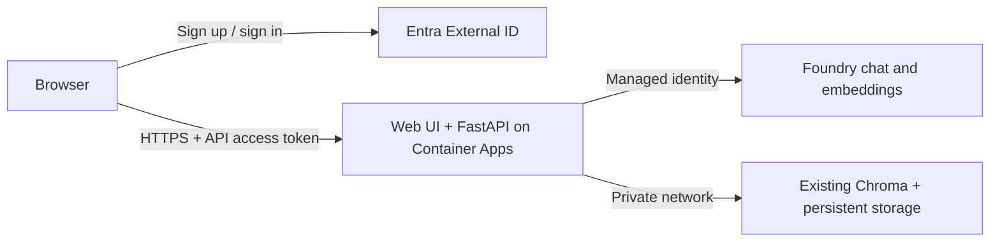

# Foundry Knowledge Assistant

An authenticated web application over the existing Foundry chat/embedding deployments and a shared Chroma knowledge base. Public users create individual accounts through **Microsoft Entra External ID**. Every authorized user can query the same corpus. There are no public upload, ingestion, collection-management, or database endpoints in this application.



**Hosting:** this repository deploys the custom web app on Azure Container Apps. Foundry supplies the model deployments. This is not a Foundry hosted-agent deployment; adapting to the hosted-agent protocol is a separate option. **MCP is not required** for a browser/API RAG app. Add MCP only when external agent clients need a tool interface, with the same authentication and authorization controls.

## Runtime behavior

- `GET /` serves the sign-in and question interface, built locally from MSAL Browser.
- `POST /api/chat` requires a signed, unexpired v2 delegated access token for this API, from the configured tenant and SPA, with `access_as_user` permission. ID tokens and forwarded identity headers are not accepted.
- `GET /api/config` returns only public SPA settings.
- `GET /health/live` checks the process. `GET /health/ready` checks that the configured Chroma collection exists and contains documents. Readiness does **not** make billable model calls or certify model permissions.
- Questions are independent; chat history is not stored. Answers include source labels and one-based PDF page numbers. Generated citations still need review.
- Serving reads existing collections and never creates or modifies them. Chroma v2 REST reads use explicit timeouts; upstream failures return 503 rather than a fabricated successful answer.
- Each process allows 4 concurrent model requests, 10 questions/minute/user and 60 questions/minute overall by default. Payload, question, context and output sizes are bounded. Chat requests return 504 after 120 seconds; any remaining upstream work retains its concurrency slot until it finishes. The deployment uses **one worker and one replica**. Before scaling, use a distributed quota/rate limiter (for example API Management) and review aggregate Foundry token budgets. Process-local counters reset on restart; they are not billing quotas.
- Logs contain request IDs, status and duration, not questions, answers, access tokens, retrieved chunks or upstream error details. The UI renders model output as plain text.

## 1. Configure individual accounts

Use an **External ID external tenant**, which supports customer self-service signup. It can be separate from the Azure subscription's workforce tenant. Customer identity does not grant users direct access to Foundry or Chroma.

1. In the external tenant, register two applications: **RAG API** and **RAG Web (SPA)**.
2. On the API registration, expose `api://<API-client-id>/access_as_user`. Set the manifest `api.requestedAccessTokenVersion` to `2`.
3. On the SPA registration, add a **Single-page application** redirect URI `http://localhost:8000/` for development and the exact production `https://<app-FQDN>/`. Add the API's delegated `access_as_user` permission, grant tenant admin consent, and preauthorize the SPA if required by your tenant policy. Do not create a SPA client secret and do not enable implicit grant.
4. Create a signup/sign-in user flow, choose the supported account providers (for example email/password or email one-time passcode), and associate the SPA with that flow. Configure abuse protections and MFA appropriate to your audience in External ID.
5. Set `AUTH_AUTHORITY` to your tenant-specific MSAL authority. Open its v2 OIDC discovery document and copy **exactly** the `issuer` and `jwks_uri` into `AUTH_ISSUER` and `AUTH_JWKS_URL`. External ID host/issuer formats differ from workforce tenants; do not substitute `common` or guess the issuer.
6. `AUTH_AUDIENCE` is the **API registration's client ID**, `AUTH_SPA_CLIENT_ID` is the **SPA registration's client ID**, and `AUTH_SCOPE` is the full exposed scope. These IDs are public configuration, not secrets.

References: [External ID overview](https://learn.microsoft.com/en-us/entra/external-id/customers/overview-customers-ciam), [MSAL initialization and redirect flow](https://learn.microsoft.com/en-us/entra/msal/javascript/browser/initialization), [API token validation](https://learn.microsoft.com/en-us/entra/identity-platform/access-tokens).

## 2. Run locally

Preserve your existing `.env`. Merge the required settings from [.env.example](.env.example), including `CHROMA_URL` (the previously hard-coded host) and the External ID configuration. The application refuses to start without authentication settings. There is no anonymous development bypass.

```powershell
uv sync
npm.cmd --prefix web ci
npm.cmd --prefix web run build
az login
uv run uvicorn app.main:app --host 127.0.0.1 --port 8000 --no-access-log
```

Open `http://localhost:8000/` and sign in. Local development requires your Azure login to have model inference permissions, or keys explicitly configured through `.env`. The browser only receives customer access tokens; Foundry keys remain on the server. Use the **same embedding deployment/dimensions** as those used to create the Chroma collection. Your existing collection's metric is preserved; an optional `MAX_DISTANCE` must be calibrated to that metric and your documents.

`uv sync --extra learning` also installs the optional local sentence-transformer/FAISS dependencies for older learning examples. The production image excludes them.

## 3. Prepare Azure resources and identity

Use a **new web Container App** in the same Container Apps environment as Chroma. That environment must allow public ingress; an internal-only environment needs a separately designed public gateway.

Keep Chroma's existing persistent volume and database. Configure its ingress as **limited to the Container Apps environment** and use its current internal FQDN in `CHROMA_URL`. Ingestion then runs from a trusted workload inside that environment (for example a Container Apps Job), or through an approved private-network path. Do not make the database anonymously accessible from the internet.

Create or reuse an Azure Container Registry and a user-assigned managed identity. Run these PowerShell commands after replacing placeholders:

```powershell
az login
az account set --subscription '<subscription-id>'
az extension add --name containerapp --upgrade
az identity create --name rag-web-identity --resource-group '<app-resource-group>' --location '<environment-region>'
```

Record the identity's `id`, `clientId`, and `principalId`. Grant it:

- **Cognitive Services OpenAI User** on each Azure OpenAI/Foundry resource serving the chat and embedding deployments. The scope is the model resource, not merely a project connection.
- **AcrPull** on a registry using standard registry RBAC. For a registry using ABAC repository permissions, use the appropriate **Container Registry Repository Reader** assignment instead.
- **Key Vault Secrets User** on the vault if optional secret references are configured.

```powershell
az role assignment create --assignee-object-id '<identity-principal-id>' --assignee-principal-type ServicePrincipal --role 'Cognitive Services OpenAI User' --scope '<chat-model-resource-id>'
az role assignment create --assignee-object-id '<identity-principal-id>' --assignee-principal-type ServicePrincipal --role 'Cognitive Services OpenAI User' --scope '<embedding-model-resource-id>'
az role assignment create --assignee-object-id '<identity-principal-id>' --assignee-principal-type ServicePrincipal --role AcrPull --scope '<registry-resource-id>'
```

Skip the duplicate model assignment if both deployments share a resource. Allow RBAC propagation before smoke testing. The runtime uses managed identity automatically when API keys are omitted. Existing Foundry connections do not automatically configure the container's identity, environment or network reachability.

References: [Container Apps managed identity](https://learn.microsoft.com/en-us/azure/container-apps/managed-identity), [managed identity image pulls](https://learn.microsoft.com/en-us/azure/container-apps/managed-identity-image-pull), [model inference permissions](https://learn.microsoft.com/en-us/azure/foundry-classic/openai/how-to/managed-identity).

## 4. Build and deploy

The Dockerfile builds frontend assets and installs Python dependencies from `uv.lock`. The runtime runs as a non-root user. Its build context excludes `.env`, documents, local databases, model caches, tests and learning examples.

```powershell
az acr build --registry '<registry-name>' --image 'rag-web:<unique-release-tag>' .
Copy-Item deploy/parameters.example.json deploy/parameters.local.json
```

Edit `deploy/parameters.local.json` with your actual resource IDs, image, endpoints and authentication settings. Use a new immutable release tag (or image digest). `location` must match the Container Apps environment. Determine the app URL from `https://<app-name>.<environment-default-domain>`; the environment's `properties.defaultDomain` is available in the portal or via `az containerapp env show`. Set `PUBLIC_ORIGIN` to that URL and register the same URL with trailing `/` as the SPA redirect URI.

Do not put secret values into `environmentVariables`. The template supports optional Key Vault references:

```json
{"name":"chroma-token","envName":"CHROMA_AUTH_TOKEN","keyVaultUrl":"https://VAULT.vault.azure.net/secrets/chroma-token"}
```

This is only needed if your Chroma reverse proxy requires a header. Private-network Chroma may not need an application token. If managed identity is unavailable for models, use analogous Key Vault references for `FOUNDRY_API_KEY` and `AZURE_OPENAI_API_KEY`.

Validate the filled deployment, review the Azure changes, then deploy:

```powershell
az deployment group validate --resource-group '<app-resource-group>' --template-file deploy/main.bicep --parameters '@deploy/parameters.local.json'
az deployment group what-if --resource-group '<app-resource-group>' --template-file deploy/main.bicep --parameters '@deploy/parameters.local.json'
az deployment group create --resource-group '<app-resource-group>' --name 'rag-web-release' --template-file deploy/main.bicep --parameters '@deploy/parameters.local.json'
```

The template configures HTTPS ingress on port 8000, startup/liveness/readiness probes, managed identity and one replica. It references your existing environment/registry and **does not redeploy Chroma, its volume or Foundry models**. Keep `APP_ENV` and `AZURE_CLIENT_ID` out of the user-provided environment map; the template sets them. If you attach a custom domain later, update `PUBLIC_ORIGIN` and the SPA redirect URI together.

Reference: [Container Apps ingress](https://learn.microsoft.com/en-us/azure/container-apps/ingress-overview).

## 5. Verify before sharing the URL

1. `/health/live` and `/health/ready` return 200. A missing/empty collection makes readiness fail. Check Container Apps system logs for startup failures.
2. An anonymous POST to `/api/chat` returns 401. A valid user signs up, signs in, asks a known document question and receives an answer with expected sources. This checks real External ID, networking, model identity permissions and embedding compatibility.
3. Try an unsupported question and verify that the model abstains; review the shared corpus for content suitable for every registered user. Test at your expected concurrency and inspect 429/503 rates and latency.
4. Configure Azure Monitor alerts for failures, latency and model usage, plus subscription budgets. Back up and restore-test the Chroma persistent volume. Set retention rules for application logs and review self-service signup abuse controls before a broad launch.
5. Record the release image digest. Roll back by deploying the previous known-good image/configuration; do not roll back or recreate the Chroma volume.

These files are a deployment baseline, not a claim of a completed live production validation. Tenant sign-in, RBAC, private connectivity, model quality, load and backup restoration require verification in your Azure environment.

## Trusted ingestion and tests

Existing collection, explicit trusted command:

```powershell
uv run python -m app.retrieval.vector_store --data-dir app/data
```

Only use `--create-collection` when intentionally creating a collection. Writes use stable chunk IDs and upsert, so replaying the same chunks is idempotent. Previously ingested UUID-based chunks are not retroactively deduplicated. For changed files or embedding models, ingest into a new versioned collection, validate it, then change `CHROMA_COLLECTION`; upsert alone does not remove stale chunks. There is no public ingestion API.

```powershell
uv run pytest -q
npm.cmd --prefix web run build
```

Tests use synthetic signed tokens, mocked model calls, Chroma HTTP fixtures and an ephemeral Chroma collection. They do not call your Azure services or modify your persistent database.
